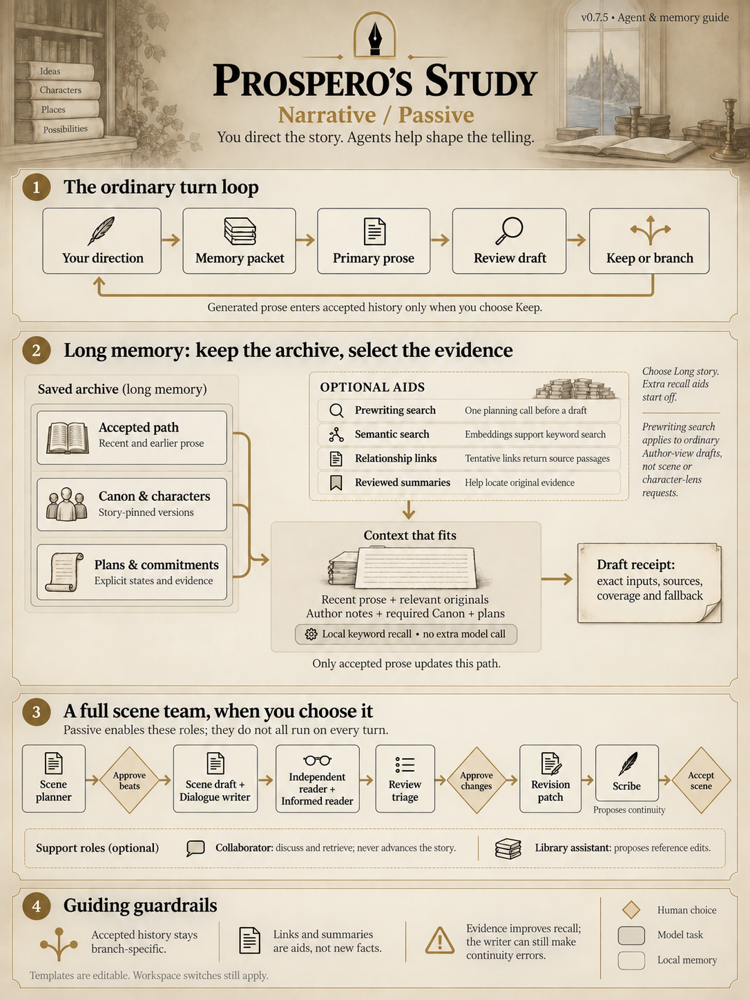
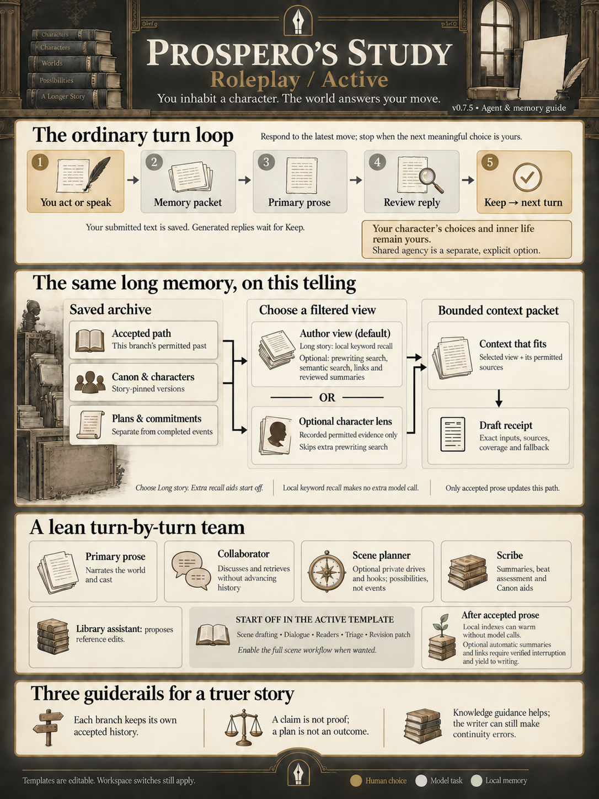

<p align="center">
  
</p>

# Prospero's Study

**Your story. Every possible telling.**

A local workspace for writing fiction with AI. Draft a scene, explore another ending, build a shared world, or step into a character's role. Keep the versions you love and decide what becomes part of the story.

**v0.9.0** · [Download release](https://github.com/vantaloomin/prosperos-study/releases/tag/v0.9.0) · [What's new](releases/v0.9.0.md) · [Windows setup](#get-started-on-windows) / [Mac setup](#get-started-on-macos) · [Choose your models](#bring-your-own-writing-partner) · [Questions](#questions)

This release adds configurable automatic backups, reviewed migration of supported writing projects, weighted inspiration decks and portable collections, and standalone HTML publishing for your Book.

## A writing room for stories that keep growing

The interesting part often comes after the first response: a better line, a different choice, a character who surprises you. Prospero's Study gives those possibilities somewhere to go.

| What you want to do | How the Study helps |
| --- | --- |
| Try the other ending | Compare tellings, favorite a path, archive an alternative, and search across branches without merging their story context. |
| Keep earlier events within reach | Long story memory recalls older passages locally; review plans and commitments without rewriting the manuscript. |
| Keep control of the draft | Generated prose appears inline as an unaccepted draft. Keep it, keep it on a new branch, try another, or dismiss it. |
| Assemble a book | Organize chapters and scenes, choose each scene's telling, bookmark passages, search the manuscript, and export DOCX, EPUB or standalone HTML. |
| Build a world across several stories | Reuse Characters and Canon collections. Each story keeps its chosen versions until you decide to update it. |
| Keep your preferred voice | Save versioned writing styles with your own examples and choose them for a Story, recipe, or individual request. |
| Reuse a writing workflow | Share a recipe, fill in its inputs, inspect its steps, and explicitly run drafting, review, and revision. |
| Work with a Companion | Discuss or revise selected text with the Collaborator, including a separate Pop Out window and reviewable Apply/Undo actions. |
| Give different jobs to different models | Choose a Primary Writer, override individual steps, and deliberately compare several models on the same inputs. |
| Make room for surprise | Create weighted inspiration decks, inspect exact odds, and deliberately draw a prompt for your unsent input. Optional Story chance systems remain separate. |
| Protect your workspace | Schedule local backups, inspect their history, and deliberately restore a verified copy as new Stories. |
| Bring earlier writing | Review supported characters, world info, transcripts and presets together, with original files and recoverable import receipts. |

### Write, direct, or roleplay

Start with **Write a story** for prose and author direction, **Build a scene** for a guided planning and revision workflow, or **Roleplay** to participate as a character. Author notes stay distinct from story text, and roleplay preferences let you reserve your character's choices.

Want to begin immediately? Choose **Skip setup** beside Continue on any setup step before the final review. Your entered choices stay intact; a blank title becomes **Untitled Story**, and the writing area opens ready for your first words. No model is required and skipping makes no AI request. Change preferences later in **Story setup**, or connect a writer in **Settings**.

New Stories use an **Agent Template**. **Passive** enables the complete writing, scene, and review workflow. **Active** starts with the writer, Collaborator, background planning, and Scribe memory tasks; full-scene drafting and readers are optional. Customize in **Story workflow > Story agents** or **Story setup > Agents**. Workspace switches in Settings remain the upper limit. Changing an existing Story's experience preserves its switches; applying a template shows the changes first.

Editable mode guidance sets the shape of a response, while separate agency guidance controls who may portray the user's character. These follow the Story's experience and agency preference independently. Active uses Flexible reply length by default. **Settings > Prompts > Mode guidance** edits workspace defaults; Story agents offers Story overrides and an option to use role prompts alone. Requests record the resolved persona name and exact section versions.

Submitting a passage can automatically request the next draft. Prefer to write uninterrupted? Turn off **Continue after sending** and generate when you are ready. Manual writing works without a model connection.

**Story brief** supplies the premise and standing guidance. **Author’s note** adds non-fiction instructions at a point on a path and can influence later requests while included by the selected context policy. **Scene goal** directs a particular planned scene. Stories collapse when you enter a workspace; use **Stories** to reopen the list. **Context** opens a spacious reference dialog. On narrow screens, **Tools** contains the workspace actions.

Generation shows the current stage, model, elapsed time, and Stop. **Keep** accepts a finished draft without requesting another prose draft. Enabled post-acceptance preparation can still run. Failed attempts preserve partial text; **Retry original inputs** reuses frozen settings and context. To use edited model settings, choose **Try with current settings** and start a new continuation in Writing tools. If a save or request response is lost, the recovery controls check its saved receipt before retrying.

### Explore without losing your favorite version

Edit an earlier passage to create a new branch. Browse alternative responses, return to an accepted telling, and keep different continuations alive. The branch map makes those paths visible; changing your mind does not require replacing the story you already have.

Use the branch tools to compare two tellings side by side, navigate changed passages, and open either source. Favorite paths you return to often. Archiving a telling hides it from ordinary browsing while retaining its prose, descendants, references, and Book selections. Cross-branch search groups shared passages and can include archived paths. A search result or comparison does not add sibling-branch prose to the active writer's context. **Send selection to Companion** can explicitly pin a comparison or selected source for discussion.

**Remove passage from this path** creates a revised path with a removal marker and **Undo**. Later prose stays in order. The original path and private archives retain the original text. Future context and readable exports exclude the removed passage. Dependent memory, plans, and chance/background state from that point onward stay on the original path; acknowledge the reset to the state before the passage and review later prose before continuing. No model requests or rolls are replayed.

### Assemble and publish a manuscript

Open **Book** in the workspace header (or **Tools > Book** on narrow screens). Add chapters, then select a telling and a passage range for each named scene. Move scenes within or between chapters and reorder chapters. **Save manuscript** records the organization; unsaved edits remain a local draft. Each selection captures a point on its path, so later writing cannot silently change the assembled book. **Choose telling** deliberately updates a selection.

**Read & bookmark** presents the chosen scenes in book order. **Search** covers all saved chapters and jumps to matching passages. **Publish** prepares a fixed version for download as editable **DOCX**, **EPUB 3**, or standalone **HTML**. HTML has optional linked contents and embedded reading/print styles; it opens offline without JavaScript or network access. Publication settings include title, author, language, optional scene titles, and whether to include character contributions. Author's notes, bookmarks, private context, and model records are excluded. The source Story and its alternate tellings stay available. See [HTML publishing](html-publishing.md) for formatting, privacy and print details.

### Keep the past, and what is still to come

In **Story setup > Writing preferences > Story memory**, choose **Long story** to keep recent prose and retrieve relevant earlier passages within your model's context allowance. Standard retrieval runs locally and makes no extra model calls. Your complete manuscript stays saved, and the context inspector shows the initial writing inputs. **Full history** remains available and pauses writing when the whole path exceeds the model's limit.

Start with **Writing tools > Memory readiness > Open memory preferences**:

1. Choose **Long story** for local recall without extra model requests.
2. Optionally enable **Check earlier evidence before writing**. This is required for semantic search and relationship links to help a new draft.
3. For semantic search, enable **Also search by meaning**, then use **Open writer profile** to set an embedding model and its input format.
4. For relationship links, enable **Use tentative relationship links** and prepare existing passages in **Story memory > Relationship links**. Automatic preparation is a separate opt-in for newly accepted prose and uses the Story's default writer, including its writer-step override.

**Memory readiness** updates for the selected writer and offers direct controls for missing dependencies. “Configured” means the embedding settings exist; the actual request still needs an available connection and sufficient cache coverage. Background eligibility expires with its verification. Character-lens writing reports its narrower scope. No readiness check makes a model request or measures narrative correctness; inspect each draft's receipt for the actual inputs and fallback.

| Optional feature | Extra model work |
| --- | --- |
| Local recall, readiness, phrase check, local index warming | None |
| Prewriting search | Up to one planning request per writer candidate |
| Semantic search | Up to five embedding requests per candidate, including bounded cache warming |
| Relationship preparation | Up to four text requests per explicit batch or newly accepted update |
| Background interruption verification | Two short synthetic requests; no story text |
| Automated wording cleanup | Up to one polishing request per flagged candidate |
| Revise continuity | One text request per explicit proposal; reuses saved evidence |

Comparing writers applies these limits separately to each candidate. Summary preparation, plan review, and other configured agents have their own explicit controls and costs.

**Check earlier evidence before writing** is an optional extra step, off by default. Each writer candidate can make one preparation request using its saved model, suggest up to two searches, and consider up to eight exact passages from accepted prose on that frozen path. New evidence shares the existing input allowance and can replace optional excerpts; notes, required Canon, plans, and the latest context remain protected. The preparation request has a 60-second limit and a bounded output; failure retains the original context with an explanation. Each draft's **Prewriting recall** receipt records queries, selected/dropped passages, timing, and exact final writer context. Completed preparation is reused on explicit retry and **Try another**. Character-lens writing and scene workflows do not use this option yet. It does not guarantee that all relevant events were found, and it never accepts events or changes character knowledge. Implementation and verification are recorded in [the enhanced Story memory goal](enhanced-story-memory-goal.md).

Recorded plan evidence can link a promise, a handoff and a later outcome across earlier plan edits. A search match can fetch those linked originals together. Accepted scene descriptions and enabled reviewed summaries can also locate exact earlier prose. Receipts show whether the known group was supplied completely or partially; unavailable or excluded evidence prevents a complete claim. Unrecorded relationships can still be missed.

**Use tentative relationship links** adds optional model interpretations that help prewriting recall find related originals. Enable it in Story memory preferences, then open **Writing tools > Story memory > Relationship links** to prepare up to four missing passages. Each request uses the Story's writer profile, with ceilings of 60 seconds and 1,200 output tokens. Links keep exact supporting quotations and distinguish events, intentions, testimony and knowledge claims. Exact quotations do not make an interpretation true. These links never change accepted facts or plans, and reviewing each one is optional. You can inspect inputs and quotes, stop preparation, or explicitly retry a failed request.

The separate **Prepare links after accepted prose** switch applies to newly accepted prose and requires verified background interruption on the model connection. It yields to foreground writing. Other connections, including OpenRouter, support explicit preparation. Enabling it does not backfill old prose; stopped or interrupted requests do not silently resend. Changes to the permitted source path invalidate dependent links. Draft receipts and story archives preserve frozen evidence and preparation records.

**Also search by meaning** is a separate opt-in under prewriting recall. First add an **Embedding model ID** under the writer profile's **Semantic story recall** settings. Local, OpenAI and compatible connections use their embedding endpoint; the [LM Studio embedding endpoint](https://lmstudio.ai/docs/developer/openai-compat/embeddings) is supported even when writing uses its native protocol. Permitted prose and search queries go to that configured connection. Keyword and semantic searches run independently, then combine their ranks. Each candidate can make up to five embedding requests and take up to 30 additional seconds. At most 64 new source chunks are prepared per request, and keyword search remains active while the cache warms or if embeddings fail. Supported search size is at most 4,096 chunks and two million vector components. Saving a profile starts a fresh embedding cache version. The draft receipt records embedding model, calls, elapsed time, cache coverage and fallback. Completed preparation and final writer inputs survive retry and archive restore without another embedding request.

For **Nomic Embed Text v1.5**, choose **Embedding input format > Nomic search prefixes** in that profile. This supplies the model's document and query prefixes and uses a separate cache. **Plain text** remains the default for existing profiles; select the format required by your embedding model.

Open **Context > Memory** to record **Plans & commitments**: who agreed, who withdrew, what was postponed, and what actually happened. A planned camping trip stays distinct from a completed trip; one person's refusal does not automatically cancel everyone else's plans. Records keep supporting passages and version history on the relevant branch.

**Review plans** can ask your configured model to suggest updates from accepted passages. Review a suggestion and explicitly save it before it becomes memory. You can also edit plans yourself without a model request. Summaries are optional too: prepare and review them in **Writing tools > Story memory**, then enable their use in Story memory settings.

Memory is selective and can miss indirect references, changing motives, or important evidence. Model-generated suggestions and summaries can misinterpret a passage even when their quotations are exact. Inspect the supplied context and keep author review part of your workflow. This release does not promise perfect recall.

In a small equal-budget live comparison, linked recall supplied 19/19 required permitted passages, versus 12/19 for baseline and 17/19 for prewriting search. Drafts still omitted retrieved events and invented unsupported history. See [the evaluation](enhanced-story-memory-evaluation.md) for the seven cases, model, costs and limitations; this is evidence of improved retrieval in those fixtures, not guaranteed narrative accuracy.

A subsequent [reliability evaluation](narrative-reliability-evaluation.md) adds repeated comparisons with two writers, fresh knowledge/uncertainty cases, live semantic retrieval and real-prose storage/timing measurements. The tested extra writer guidance and draft checker remain experiments because they still missed consequential mistakes. The completed [consolidation goal](narrative-reliability-goal.md) records measured gains and remaining limits.

New prewriting requests retain query matches already supplied in context when making room for other evidence. [The follow-up](narrative-reliability-followup.md) records improved final-packet coverage at unchanged budgets, historical replay checks, and eight live continuations through a coherent manuscript and an earlier fork. Saved requests keep their original packing behavior. Quoted reading notes and extra thinking were also tested; neither established a general fix for unsupported history.

Unaccepted drafts also offer **Revise continuity**: describe a suspected mismatch and request one alternative using the same saved evidence and profile. Compare it with the original before choosing **Keep**. The model can still miss a problem or introduce another; automatic checking remains experimental. Requests that cannot fit the original evidence plus draft fail without dropping sources. See the [consolidation audit](narrative-reliability-audit.md) for measured improvements and limits.

### Agents and long memory, illustrated

These guides show how the agent templates, accepted story history, and optional recall features fit together. Expand either guide, or open its full-size image to read the details. Templates can be customized; enabling a role does not run it on every turn.

<details>
<summary><strong>Narrative / Passive — author-led writing and the full scene team</strong></summary>

Direct the story, review proposed prose, and choose what to keep. The optional scene route brings planning, drafting, readers, revision, and the Scribe together around your approvals. Long story memory selects relevant evidence from the current path within the writer's context allowance.

[](design/infographics/narrative-passive-agents-memory-v075.png)

</details>

<details>
<summary><strong>Roleplay / Active — character agency and the turn-by-turn team</strong></summary>

Contribute your character's next move and review how the world responds. Active starts with a smaller set of enabled tasks. Author view remains the default; the optional character lens uses recorded permitted evidence and skips extra prewriting search. Character agency is a separate setting.

[](design/infographics/roleplay-active-agents-memory-v075.png)

</details>

Both guides describe v0.7.5. **Long story** is a deliberate memory setting, and extra recall aids start off. Generated prose still requires **Keep**; retrieving evidence does not guarantee that the writer uses it correctly.

### Review recurring wording

Open **Writing tools > Phrase check**, enable it for this path, and choose **Check wording**. The local check finds recurring phrases in accepted prose and shows exact highlighted excerpts with links back to the manuscript. It makes no model calls and leaves the story unchanged.

Choose the latest 20 or 100 prose passages, or this path within the displayed size limit. Counts refer to the checked text. Author’s notes, removed passages, and unaccepted drafts are excluded. This first feature checks wording; it does not judge pacing or identify repeated meaning.

Suggestions offer editable guidance for varying wording or considering a cut. Copy it when useful, dismiss a particular observation, or mark wording intentional. Hidden observations and intentional phrases can be restored. The phrase-check toggle and review choices are saved on this device for this path, independently of other branches, and are not included as preferences in story archives. Phrase checks leave writer instructions unchanged.

**Writing tools > Automated cleanup** is a separate option, off by default. When enabled, the writer finishes its response, then the local phrase detector checks it against up to 20 recent accepted prose passages. Eligible repeated wording can trigger one polishing call with the same saved writer profile. It works with **Continue story**, **Continue after sending**, and writer comparisons; every candidate has its own one-call limit.

Choose **Finish before draft is ready** to include cleanup in the writing turn, or **While I read** to use the original immediately while cleanup runs separately. With reading-time cleanup, the displayed wording stays original until you choose the cleaned version. **Keep** freezes that choice and stops pending cleanup. Typing or making another model request interrupts optional inference; foreground writing and required assessment take priority on shared hardware.

Reading-time inference currently supports LM Studio native profiles using local HTTP, no API authentication, and model-default reasoning. Load the saved model, then open **Settings > Models > Edit > Verify background interruption**. Two short synthetic requests check a server-acknowledged stop and a completed follow-up; no story text is sent. Verification lasts 30 minutes in this app session and applies to that saved configuration. Unsupported or unverified connections skip reading-time cleanup with an explanation; cleanup before ready remains available. If a stop is not acknowledged, the shared resource stays blocked until you restart the model server and explicitly reset the check.

Cleanup changes only flagged spans and preserves the complete original. Open **Compare original and cleaned wording**, then choose **Use original wording** or **Use cleaned wording** before **Keep**. Nothing enters the manuscript until you keep it. **Stop cleanup; keep original**, turning the toggle off, provider failures, and interruption leave the original usable. Changed paths, author memory decisions, and draft revisions prevent stale cleanup from being applied.

New accepted passages also warm the existing local chunk and word indexes during idle time, without model calls. Work is bounded and yields to writing; ordinary retrieval handles anything not cached. Branch eligibility, plans, and memory choices are still computed from the current story. Automatic model-based summary maintenance uses the same verified background admission; manually requested summaries remain available with other connections. **Observed timings** separates context preparation, model queueing, first text, and draft readiness; cleanup has its own usage and elapsed time. Profiles on the same local hardware share one inference slot by default. The optional **Shared inference resource** setting can identify independent hardware or explicitly group connections.

Intentional and dismissed phrase choices from this browser are captured when the writing request starts; matching wording is protected during cleanup even if manual phrase checks are off. Enabled author-memory motifs also protect matching wording. New choices apply to new requests; stop pending cleanup to keep its original. Names, numeric wording, and capitalized content words are conservatively left alone. The detector is deterministic phrase matching, not ML or a judgement of meaning. The polishing model can still misjudge equivalence or voice, so inspect its changes before keeping them.

The cleanup toggle is saved for this path in the local workspace; new branches and restored archives start with it off. Archives preserve both draft versions, captured request choices, and cleanup evidence. Interrupted cleanup is not automatically retried or resent. The detector scans at most 200,000 characters or 40,000 words across the draft and complete recent passages, and permits at most 12 short, nonoverlapping replacements. Semantic detectors and homeostatic retrieval remain future work.

See the [published v0.7.5 release](https://github.com/vantaloomin/prosperos-study/releases/tag/v0.7.5) for the original memory update and the [changelog](CHANGELOG.md) for later changes. The [published v0.7 features](CHANGELOG.md#v07---2026-09-18) are included.

### Write in your own style

Open **Library > Styles & recipes** to create a writing style. Add any useful combination of prose, viewpoint, tense, dialogue, rhythm, description, unwanted habits, and your own examples. **Analyze selected samples** can propose editable guidance using a model; review the suggestions and publish a version separately. Examples remain style references, not accepted Story events or Canon.

A Story keeps its chosen style edition until you explicitly adopt another. Individual requests can override it, including **No style profile**. The order is request choice, recipe choice, then Story default. An explicit choice of none stops inheritance. Styles guide prose and requested wording revisions; they do not alter factual memory tasks, character agency, or source permissions. Saved requests and retries retain their original style and examples.

### Reuse a writing recipe

Recipes combine instructions, typed inputs, task choices, model assignments, optional style, reader lenses, and chance settings. Start with **Quiet character scene**, **Revise for tension**, or **Dialogue pass**, then customize and publish your own edition. **Export** produces a portable file; including examples is a separate choice. Import previews identify missing local models or Library references for explicit mapping. Importing changes no active Story settings and starts no work.

Select text in the composer or a supported text editor and choose **Run recipe**. Fill in its inputs, review the effective choices, then **Preview complete recipe**. Workspace disables remain a ceiling; explicit run choices override the recipe and Story defaults. Disabled optional readers are shown as skipped. Saving freezes the run and, if requested, prepares one draft-local chance result. It starts no model calls and changes no accepted mechanics.

Each step has **Preview next recipe step** and **Start this recipe step**. Inspect exact instructions, model, source scope, input allowance, and output limit before sending. Later inputs are prepared from earlier results; their size stays unknown until then, and provider cost stays unknown unless reported. Finished prose becomes an editable proposal with Apply/Undo. A review-only recipe presents reports without changing text. Return through **Story workflow > Recipes** to continue or inspect a saved run. Stop, retry, reload, and restart retain original inputs; later steps never start automatically.

Single-step writing and Companion controls accept only recipes applicable to that task. Use **Run recipe** for a complete multi-step or chance-based workflow. Publishing or archiving a recipe does not change its saved runs or silently update Story pins.

### Give your world a home

The Library holds **Characters** and **Canon collections**: people, places, setting details, rules, and reference material. A collection can belong to several stories, and a story can draw on several collections.

Canon has Markdown working files you can edit with your preferred editor. **Library > Import file** accepts Markdown, SGC knowledge packs, Character Card V1/V2/V3 JSON or supported PNG cards, and Pygmalion or Backyard/Faraday legacy characters. Standalone portable character lorebooks, SillyTavern world info, NovelAI lorebooks (versions 3–6), Agnai memory books, and RisuAI lorebook exports (version 1) can arrive as JSON or `.lorebook` files. Each file is limited to 10 MiB; conversion runs locally without a model.

Review the proposed fields before publishing. Native imports show where each supported field goes and what remains reference material. The exact original and converted Markdown stay available for download. Imported lorebook entries remain separate from the active Canon overview: after publishing, use **Edit Canon entries > Bring in preserved entries** to review individual entries and their primary keyword proposals. Added entries start off. Native regex, secondary conditions, timing, ordering and priority values need review; their original fields remain preserved.

The character importer also accepts bounded **CHARX V3** and **Backyard BYAF schema-1** containers, with explicit artwork selection. DOCX/PDF/EPUB import and arbitrary source-application compatibility remain outside the supported matrix.

For a project with several files, use **Library > Migrate writing > Mixed files**. Review up to 20 supported files together, correct transcript roles and reply choices, and publish items separately. Supported transcripts include SillyTavern JSONL, role/content JSON, and explicitly labeled text or Markdown. Supported SillyTavern and NovelAI presets become inert recipes and optional inactive local profiles; connections and credentials are not imported. Duplicate proposals default to skip, with explicit copy or version-update choices. Saved receipts recover interrupted publication after restart. See the [migration compatibility matrix](migration-compatibility.md) for exact variants, bounds and retained reference material.

Publishing an edit creates a new version. Existing stories keep their selected versions; you can compare changes and apply an update to the stories you choose. Earlier versions remain available.

### Keep inspiration at hand

Open **Library > Inspiration** to create weighted decks or review the three starter collections. Publish a version, then use **Preview & draw** to inspect exact odds, required tags and exclusions before recording a draw. Each draw uses its saved deck version; editing the deck preserves earlier results. Seeded previews are separate from recorded draws, and draws use replacement.

In a Story, open **Inspiration**, inspect or copy a result, or **Add to unsent input**. Sending remains a separate action. These draws do not enable Story randomness, request a model or accept Canon. Export selected deck versions as a portable collection and review duplicates before importing. See [inspiration decks and collections](inspiration-compatibility.md) for limits and recovery behavior.

### Keep a collaborator in the wings

The Sidebar Companion is labeled **Collaborator** in the app. Use it to brainstorm, ask about motivations, improve a prompt, or work on selected text. **Send selection to Companion** shows the exact source and range before pinning it to a conversation. Follow the current telling or keep a saved passage, scene, earlier context, or branch comparison pinned. Renaming, searching, archiving, and reopening conversations preserves their drafts, sources, and edit history.

Choose **Rewrite**, **Expand**, **Shorten**, **Change tone**, **Apply style**, or **Write new text** for a supported text target. The normal result is an editable proposal with before/after comparison and Apply/Dismiss. **Apply this requested change** explicitly authorizes that one result at the displayed destination; it needs no second confirmation. A changed destination produces a conflict requiring review and rebasing. Applied changes retain a receipt and **Undo / restore previous text**. Accepted-passage edits create a revised telling with later prose preserved; they leave Book selections on their original sources. Library and prompt edits follow their versioning and adoption controls.

The Companion can add, insert, replace, or update scoped text; it cannot turn discussion into unrequested story progression, accept plans, change non-text settings, roll, or merge branches. Model output cannot expand the selected target or its application permission. Generated wording remains subject to the selected source and character-agency rules. Inspect **Preview Companion request** to review effective guidance and the exact initial inputs without sending.

Its connection is shown above the conversation. **Change connection** saves the Collaborator assignment for this Story; **Manage connections** opens model setup and returns to the chat. Choose Docked, Floating, Full workspace, or **Pop Out** for a separate browser window. Return to the workspace explicitly. Both views share saved conversations, pins, model choices, requests, and edit proposals; conflicting unsent wording stays available for review. Closing or reopening a view never resends a request. A blocked popup, closed parent, or lost server connection offers recovery controls. Window placement depends on the browser and operating system.

For a structured session, the scene planner proposes options and beats for your approval. Drafting and optional dialogue lead to two readers: an independent reader with eight selectable lenses, and an informed reader checking rules, continuity, and approved beat coverage. Triage resolves findings against supplied evidence; unresolved claims need your decision. One revision patch can change both prose and dialogue, then the Scribe proposes continuity to keep. You approve the plan, revision package, and final scene.

The standard scene with split dialogue and both readers uses nine model requests. Model comparisons, separate character actors, and retained specialist settings can add requests; each preview shows the actual count. Optional beat assessment runs after accepted prose and prepares the next opportunity. Writing can begin immediately; pending, failed, or stale preparation supplies no chance result to that request.

### Make the room your own

Choose from six palettes or preview custom accent, background, surface, and text colors. Interface size supports 85–200%, exact entry, presets, and reset; older settings retain their rendered size. Reading size and fonts remain independent. Reduced motion is available. Reading fonts include Literata, Arimo, Atkinson Hyperlegible, OpenDyslexic, Lora, and Source Serif 4. Fonts are bundled with the app.

Eleven roles have editable, versioned instructions in **Settings > Prompts**. The planner, Scribe, and Library assistant handle several named tasks. Enable or disable roles, tasks, or whole sections. Earlier custom prompts, Story pins, model assignments, and disabled tasks remain visible under their combined role. Choose to adopt the combined instructions explicitly; saved inputs and original retries retain their recorded versions.

## Coming from SillyTavern or another LLM chat app?

Bring your character cards and preferred model connections, then try a workflow organized around the story you are making:

- Explore alternate scenes through a visual branch map.
- Discuss a draft in the sidebar before deciding how the narrative should continue.
- Keep plans, commitments, and earlier passages available as the story grows.
- Share versioned world material across several stories.
- Choose a different writer, reviewer, or collaborator for each job.
- Export a readable Markdown manuscript or a private archive of your work.

Character and lorebook imports include a review step. Compatibility with every third-party extension, macro, or automation is not assumed; unsupported material is preserved with conversion notes. Imported scripts are never executed, media links are not fetched, and macros stay literal.

## Bring your own writing partner

Use **Settings > Models** to save connections. **Test connection** discovers available models where the provider supports it, and the model picker lets you type to filter a long list. Reported limits help fill in your settings; limits a provider does not report remain editable.

| Connection | What you need |
| --- | --- |
| OpenAI | An OpenAI API key |
| Anthropic | An Anthropic API key |
| Google / Gemini | A Gemini API key |
| OpenRouter | An OpenRouter API key |
| Codex / ChatGPT | Codex CLI installed, available on PATH, and already signed in |
| Local / LM Studio | A running local server; compatible API or LM Studio native with thinking controls |
| Kobold | A running server exposing the native Kobold generation API |
| OAI Compatible API | A compatible Chat Completions API address and any required key |

Set one profile as **Primary Writer** to get started. Add role-specific profiles or explicit model comparisons when you need them. Profiles can use different providers; the app does not silently switch providers if a request fails.

In a profile's **Generation settings**, reserve separate room for story input, total output, and a context safety margin. Thinking controls vary by adapter: effort, budget or adaptive modes, compatible chat-template thinking, or LM Studio's discovered native options. Blank controls keep provider defaults. Manual thinking budgets must leave the configured response space; reported model limits and supported options are checked when available. Sampling controls also vary by adapter and model.

**Maximum output tokens** includes thinking where the provider counts it. Set the desired prose length in Story setup separately. Request results show reported input, output, thinking, response, and cached tokens, with the raw usage report available. Unreported counts or cost stay unknown. OpenRouter charges are shown in reported credits; explicitly reported USD charges retain their currency. Changing a profile affects new requests; original-input retries keep the old limits.

Provider usage, pricing, and access depend on your chosen service. Models and API credits are not bundled with the application.

## Get started on Windows

1. **Download and extract [the v0.9.0 source ZIP](https://github.com/vantaloomin/prosperos-study/releases/download/v0.9.0/prosperos-study-v0.9.0-source.zip).** Open the extracted folder before running the scripts. The [release page](https://github.com/vantaloomin/prosperos-study/releases/tag/v0.9.0) also provides a file manifest and SHA-256 checksums. Git users can check out the `v0.9.0` tag.
2. **Run [install.bat](install.bat).** It sets up the dependencies and builds the interface. It looks for Python 3.12+ and Node.js 22.12+, and can install missing runtimes through WinGet. An internet connection is needed for downloads.
3. **Run [launch.bat](launch.bat).** Your browser opens the Study at `http://127.0.0.1:8765`. Keep the launcher terminal open while writing; press **Ctrl+C** there to stop the app.
4. **Start a new story.** Follow the guided setup, or choose **Skip setup** to start writing immediately. Any choices already entered are retained. You can write manually without a model and change settings later.

A second launch reuses the existing app. To update, stop the app, update the source files while keeping your `data/` folder, rerun `install.bat`, and launch again. Save a workspace backup before updating.

If WinGet is unavailable, install Python and Node.js yourself and rerun the installer.

## Get started on macOS

Download and extract [the v0.9.0 source ZIP](https://github.com/vantaloomin/prosperos-study/releases/download/v0.9.0/prosperos-study-v0.9.0-source.zip), or clone this repository and check out the `v0.9.0` tag. In Terminal, change to the project folder and run:

```bash
cd "/path/to/prosperos-study"
bash install.sh
bash launch.sh
```

[install.sh](install.sh) creates the local Python environment, installs the pinned dependencies, and builds the interface. It uses an existing Python 3.12+ and Node.js 22.12+ installation when available. If either is missing, it can install it through [Homebrew](https://docs.brew.sh/Installation), using [Python 3.12](https://formulae.brew.sh/formula/python@3.12) and [Node.js 24](https://formulae.brew.sh/formula/node@24). Both standard Apple Silicon and Intel Homebrew locations are checked; Homebrew support depends on your macOS version and hardware. If Homebrew is not installed, the script explains how to install it or supply the runtimes yourself.

[launch.sh](launch.sh) opens `http://127.0.0.1:8765` and runs the app in the same terminal. Keep it open while writing; press **Ctrl+C** to stop. Launching again reuses a healthy running instance. It does not reinstall dependencies or start a hidden server.

Use `bash install.sh --check-only` to check an existing installation, or `bash launch.sh --no-browser --port 8765` to control launch options. After updating, stop the app, save a backup, rerun `bash install.sh`, and launch again. Keep your `data/` folder. If transferring the project between Windows and Mac, create a fresh `.venv` on the destination; Python environments are platform-specific.

The shell workflow has automated tests; installation, browser opening, and Keychain access still need a native macOS smoke test for this preview.


## Your work stays yours

Stories and Library material are stored locally in the project's `data/` folder. Cloud generation sends the context needed for a request to the provider you select; local model connections keep that inference on your own machine. API keys are stored separately in the operating system’s credential vault. Add or replace a key through explicit visible token entry; saved keys are never fetched back into the editor. The regular-Chrome check showed no password suggestions. Bitwarden was unavailable for testing, so its behavior remains unverified.

- **Export transcript** creates readable Markdown for a selected branch or passage.
- **Private archive & recovery** saves a story with its branches, connected Library versions, and saved workflow records.
- **Settings > Backups & recovery** creates a workspace backup or restores a saved archive as new Stories. **Automatic backups** adds an off-by-default schedule with interval, retention, destination and private-sidebar controls.

Readable exports and restorable archives serve different purposes. Private archives contain story material and are not encrypted. Keep saved backups somewhere safe. Automatic copies are created while the app server is running, with one catch-up copy after downtime. Choose the default folder beside your database or an existing absolute folder accessible to the server. History shows success, failure and file availability; **Review & recover** verifies a copy before deliberate restore. Scheduled retention removes only this workspace's owned scheduled copies after a successful new backup. Manual copies are retained separately. Imported archives never activate a backup schedule or destination.

**Archive format 54** adds accepted transcript/preset provenance, inspiration deck versions, recorded draws and collection originals to the existing manuscripts, memory, writing resources, branch curation, text edits and Companion records. It accepts earlier supported archives, including the published v0.7.0 format-33 manuscript layout and the distinct memory-development layouts, by validating their complete record groups before migration. Restoring creates independent stories, remaps live identities, preserves historical provider-input bytes, disables automation, and leaves interrupted work for explicit retry. It never resends a model request or reapplies an edit. Prepared DOCX/EPUB/HTML downloads can be regenerated from the restored manuscript. Prepared download snapshots, migration staging queues and local backup settings remain installation-local; accepted foreign sources travel with their published records.

Private Companion conversations are an explicit archive inclusion choice. Excluding them still retains the edit provenance needed to validate included text changes, without copying private questions or discussion history. Portable writing bundles contain only selected style/recipe material and reference slots; they omit credentials, endpoint configuration, private conversations, and unrelated Story data. New archives are not backward-compatible with older app versions. Keep a pre-update backup if you may return to an older version. See [v0.9.0 compatibility and validation notes](releases/v0.9.0.md).

## Questions

**Can I use it without a cloud subscription?**

Yes. Use a compatible local model server, or write manually. Local generation requires a model and hardware capable of running it. Installation still needs dependency downloads.

**LM Studio is running, but the connection fails.**

For **OpenAI-compatible**, use `http://127.0.0.1:1234/v1`, including `/v1`. For **LM Studio native**, use `http://127.0.0.1:1234/api/v1`. Start the server, make a model available, and use **Test connection**. Native discovery also reports supported thinking settings. The app reports connection and endpoint errors with suggested next steps.

**The model finished, but no story appeared.**

A thinking model can spend its output allowance on reasoning before producing prose. Check the reported usage and increase **Generation settings > Maximum output tokens** if it reached the limit. Save the profile and start a new continuation. **Retry original inputs** deliberately keeps the old model settings and limit.

With **Local / LM Studio > Local API > LM Studio native**, test the connection and choose the model, then set **Generation settings > Thinking** to a supported option. This affects only that profile's requests. You can use a separate thinking-off profile for Story memory summaries while keeping your Primary Writer unchanged.

**Do I have to run every agent or random table?**

No. Randomness starts off, individual systems are optional, and prompts/agents can be disabled. Comparisons are deliberate additional requests.

**Can I use a character or Canon collection in more than one story?**

Yes. Stories select versions independently, and publishing an edit does not silently change existing stories.

**Is v0.9.0 a finished product?**

It is an early preview with the core writing workflows implemented. Expect further polish, compatibility work, and testing. The writing Sidebar Companion described above is separate from the future simulated-character Companion / Date Mode. Packaged installers, social feeds and built-in image generation remain future work. Styles and supplied evidence guide models but do not guarantee voice adherence or continuity accuracy.

Found a problem or have a suggestion? [Open an issue](https://github.com/vantaloomin/prosperos-study/issues). Include what you tried, your provider/model, and any error message; leave out API keys and private story content.

<details>
<summary><strong>For developers</strong></summary>

The interface uses React, TypeScript, and Vite. The local backend uses Python, FastAPI, and SQLite.

```powershell
python -m venv .venv
.\.venv\Scripts\python.exe -m pip install -r requirements.lock.txt
npm.cmd ci
```

For development, run the backend and Vite in separate terminals:

```powershell
.\.venv\Scripts\python.exe -m uvicorn server.main:create_app --factory --host 127.0.0.1 --port 8765
npm.cmd run dev
```

Open `http://127.0.0.1:5173`. Vite forwards API requests to the local backend. The production launcher serves the built interface and API together on port 8765.

Run the project checks with:

```powershell
powershell -ExecutionPolicy Bypass -File .\check.ps1
```

The checks cover backend tests, frontend model tests, Python/TypeScript linting, and the production build. Both complexity linters enforce a maximum of 10 per function. Tests use isolated data; keep the user's story database out of fixtures. The `ROLEPLAY_DB` environment variable selects an alternate database.

Source lives in `src/`, `server/`, `tests/`, and `scripts/`. Local data, agent files, planning archives, installed dependencies, and generated output are excluded from Git.

</details>

## License

[GNU Affero General Public License v3.0](LICENSE). Bundled fonts retain their respective licenses; see [font notices](public/fonts/NOTICE.md).
